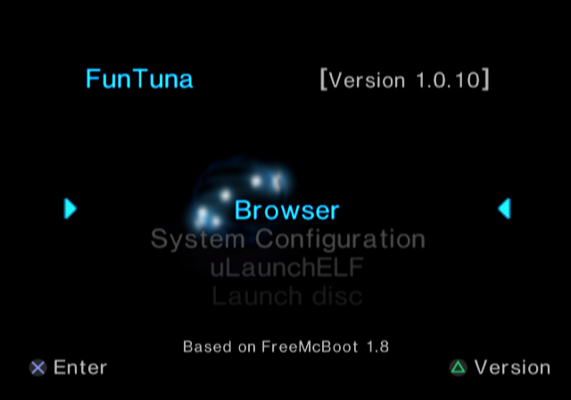

## welcome to FunTuna-Fork Website

> forked version of funtuna, a combination of ps2 software that was designed to ease the pain of getting a stable exploit for those who have a console uncompatible with FreeMcBoot (SCPH-9XXXX with BIOS >= 2.30) that doesnt have a modchip
## current package contents:

files        |         clean |     basic     | basic (light) |
------------ | ------------- | ------------- | ------------- | 
Funtuna basic files | __x__  | __x__         | __x__         |
USB Drivers  | __x__         | __x__         | __x__         | 
wLaunchELF 4.43x_isr | __x__ | __x__         | __x__         |
OPL 1.0.0    |               | __x__         | __x__         |
ESR          |               | __x__         |               |
SMS          |               | __x__         |               |

### FunTuna installed 

### Boot logo

### hacked OSDSYS

